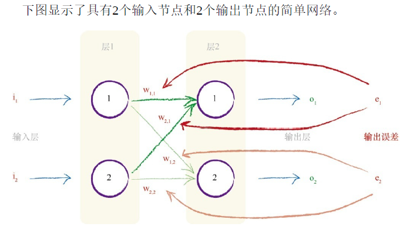

[toc]

# 手写数字识别神经网络  

要实现的神经网络:

* 识别一位的手写数字
* 输入28 * 28像素的图像 (像素使用灰度值表示 0-255, 总共有784个像素点)
* 输出正确的数字 (0-9其中一位)

## 一 简介神经网络

## 二 神经网络模型与训练

### 1 三层结构: 输入层 隐藏层 输出层

#### 简单的例子

把千米换算成英里

| 输入 千米 | 比例    | 输出 英里 | 期望   | 差值   | 反馈          |
| --------- | ------- | --------- | ------ | ------ | ------------- |
| 100       | 0.5     | 50        | 62.137 | 12.137 | 0.05          |
| 100       | 0.55    | 55        | 62.137 | 7.137  | 0.05          |
| 100       | 0.6     | 60        | 62.137 | 2.137  | 0.05          |
| 100       | 0.65    | 65        | 62.137 | -2.863 |               |
|           |         |           |        |        | (误差 / 输入) |
| 100       | 0.5     | 50        | 62.137 | 12.137 | 0.12137       |
| 100       | 0.62137 | 62.137    | 62.137 | 0      |               |
|           |         |           |        |        |               |

要素:

* 输入
* 计算过程
* 输出
* 期望与输出的差值
* 适当的反馈机制

#### 更复杂一点的例子

#### 能识别手写数字的神经网络模型

* 输入层: 对应28 * 28的图像, 每个节点对应一个像素(0 - 255)输入
* 隐藏层: 选择合适的层数和每层的数量, 这里设置了一层, 有100个节点
* 输出层: 隐藏层的结果最后以(0, 1)的范围输出到10个节点, 数值最大的节点对应的数字, 就是神经网络最终的输出结果

### 2 阶跃函数: 噪声抑制

模拟神经元的输入输出机制, 只有当输入信号达到一定强度时, 才会激活输出, 过滤掉输入信号中的微小的噪声

比如输入的手写数字的图像, 有数字的区域灰度值较高, 没有数字的灰度值较低, 但一般不会是0; 而训练时使用的数据都是理想的数据, 对噪声的抗干扰能力较弱

如果每个神经元, 对输入的信号进行抑制, 只有当灰度值达到阈值之后, 才会继续向后输出, 那么输入的图像会更接近理想的图像数据.

对阶跃函数进行改进 -> Sigmoid函数, 值域(0, 1)

### 3 权重: 神经元之间的信号传递

W是权重, 范围(0, 1)代表了从前一层节点传输到后一层节点时的信号强度

节点1-1的输出信号, 会传播到层2的三个节点

* 1-1 -> 2-1 : O11 * W11
* 1-1 -> 2-2 : O11 * W12
* 1-1 -> 2-3 : O11 * W12

节点1-2, 1-3的信号, 也会按照对应的权重, 传播到层2的三个节点, 所以层2的三个节点的输入值分别为

* IN21 = O11 * W11 + O12 * W21 + O13 * W31
* IN22 = O11 * W12 + O12 * W22 + O13 * W32
* IN23 = O11 * W13 + O12 * W23 + O13 * W33

使用矩阵乘法可以更方便的表达计算流程, 只要有一个封装好的矩阵计算函数, 那么输入`两层之间的二维权重数组`和`前一层的输出数组`, 就可以获得`后一层的输入数组`

部分语言对矩阵乘法有优化, 计算效率更高

完整的信号传播

1. 层1输入信号
2. 层1输出的结果, 需要通过S函数进行抑制, O1 = Sigmoid(IN1)
3. 根据层1和2的权重和层1的输出结果, 使用矩阵点乘计算得出层2的输入IN2
4. 层2的输出结果, 通过S函数抑制O2 = Sigmoid(IN2)
5. 根据层2和3的权重和层2的输出结果, 使用矩阵点乘计算得出层3的输入IN3
6. 层3的输出结果, 通过S函数抑制O3 = Sigmoid(IN3)

### 4 误差与反馈

#### 层与层之间的误差反馈

初始的神经网络, 各个节点之间的权重都是随机生成的, 几乎不可能输出正确的结果, 所以需要一个输出-反馈的环境, 对节点之间的权重进行调节

训练中, 使用的数据除了输入值, 还需要期望的输出结果, 在神经网络输出结果之后, 每个输出节点和期望结果之间的差值, 会按照前面的节点的权重按比例反向传播,  影响各个节点之间的权重.

误差e1, 会按照W11和W21的比例分割并反向传播

W11的最终分配到的误差: 

W21同理

#### 多层之间的误差反馈

使用矩阵乘法计算误差反馈

左边的矩阵过于复杂, 需要进行简化

使用权重占比的方式分配误差e的目的, 是让占比更高的权重能分配到更多的反馈, 那么直接使用权重*误差作为反馈的结果, 占比更高的权重同样的获得更多的反馈

所以对计算公式进行简化

3*3的神经网络的版本: 左边的矩阵是正向传播的矩阵的转置矩阵(沿左上到右下的对角线翻转, 右上元素变成左下, 左下元素变成右上, 在编程时, 可以使用函数对当前的权重矩阵转置后再点乘误差)

#### 如何更新权重

梯度下降公式

使用矩阵公式表达

## 三 代码实现

依赖的第三方库

* numpy 提供数组和矩阵运算功能
* scipy 提供sigmoid函数